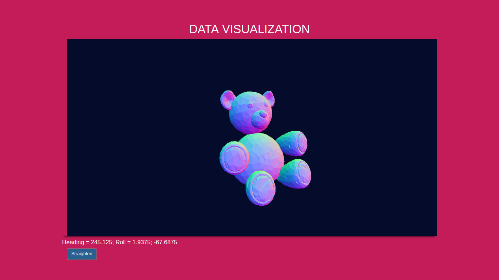

# IoToy 3D Render:

A project I made for [University of Edinburgh's IoT Research and Innovation services](http://iot.ed.ac.uk/) during my time as a software Engineer intern. This software is now widely used in primary and secondary schools across Edinburgh to aid workshops in **data science** and **Internet of Things**.

A raspberry pi Zero is connected to an accelerometer and hosts an MQTT server. We can use the **recievePi4.py** python file on our laptop to run a real-time 3D rendering of a teddy bear.

A working demo can be found [here](https://www.youtube.com/watch?v=ObJK_eU24yU)

